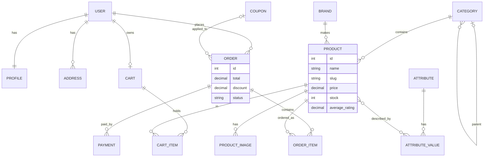

# Entity-relationship diagram (draft)

```mermaid
erDiagram
    USER ||--|| PROFILE : has
    USER ||--o{ ADDRESS : has
    USER ||--o| CART : owns
    USER ||--o{ ORDER : places

    CATEGORY |o--o{ CATEGORY : parent
    CATEGORY ||--o{ PRODUCT : contains
    BRAND ||--o{ PRODUCT : makes
    PRODUCT ||--o{ PRODUCT_IMAGE : has
    ATTRIBUTE ||--o{ ATTRIBUTE_VALUE : has
    PRODUCT }o--o{ ATTRIBUTE_VALUE : described_by

    CART ||--o{ CART_ITEM : holds
    PRODUCT ||--o{ CART_ITEM : in

    ORDER ||--o{ ORDER_ITEM : contains
    PRODUCT ||--o{ ORDER_ITEM : ordered_as
    COUPON |o--o{ ORDER : applied_to
    ORDER ||--o{ PAYMENT : paid_by

    PRODUCT {
        int id
        string name
        string slug
        decimal price
        int stock
        decimal average_rating
    }
    ORDER {
        int id
        decimal total
        decimal discount
        string status
    }
```